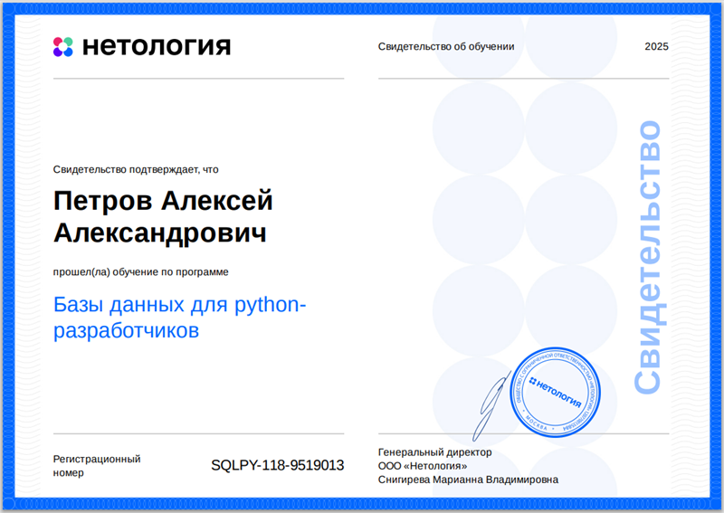
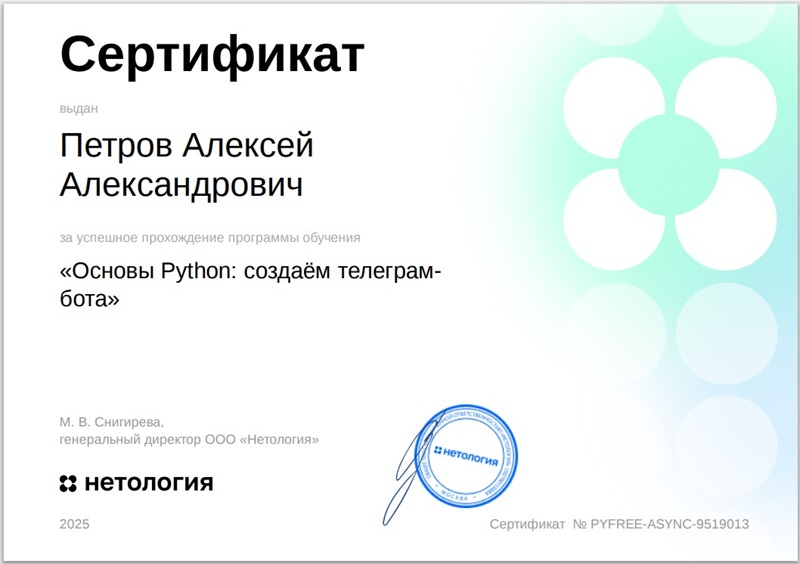
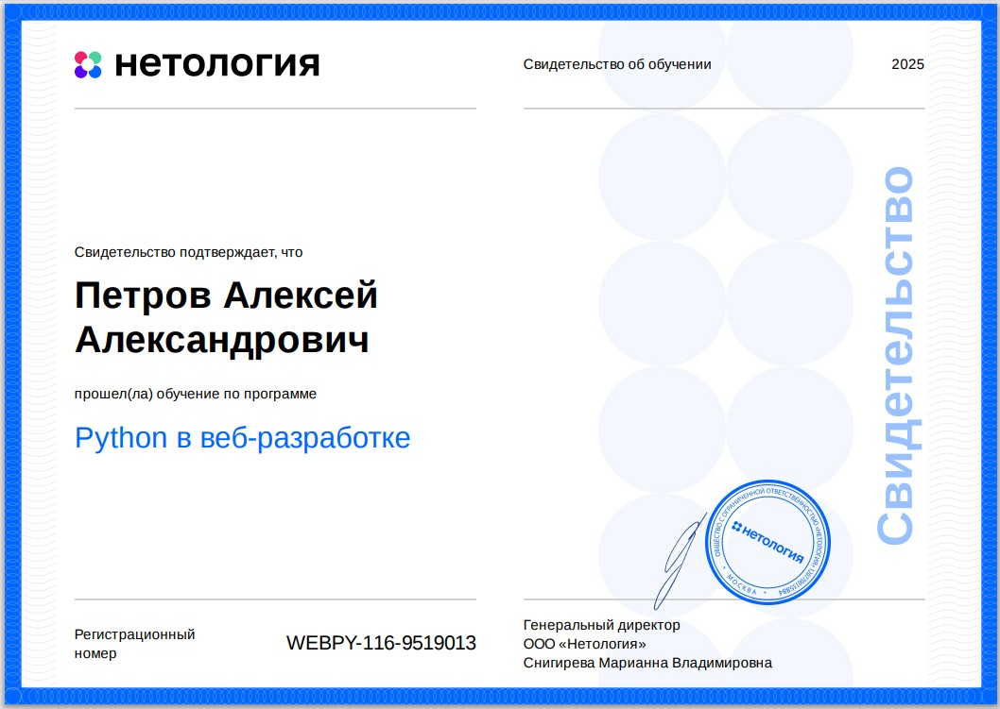

# Алексей Петров | Python-разработчик)

## Моё резюме - здесь pdf

## Hi there ✌️😁😎
Обо мне:

🔧 Прошлое: 20 лет в авторемонте → от диагностики сложных неисправностей до тонкой электроники.
💡 Навыки: Аналитический подход + умение декомпозировать задачи + металлическое терпение.

🐍 Настоящее: Завершаю курс Python-разработки в Нетологии.
🚀 Цель: Первая позиция в IT (стажировка/junior), где смогу применить:

Техническое понимание структуры задач.

Глубокое понимание логики кода.

Способность учиться со скоростью git push.

♟ Вне кода: Стратегическое мышление (шахматы) + выносливость (походы).
📩 Готов к задачам, где нужны: внимание к деталям × решение проблем.
Готов к выполнению тестовых задач.

---
## 🛠️ Технологический стек

*   **Язык:** Python 3
*   **Backend Frameworks:** Django, Django REST Framework, FastAPI, Flask, AioHTTP
*   **Базы данных:** PostgreSQL, SQLite
*   **Инструменты:** Git, Docker, Celery
*   **Прочее:** REST API, API Telegram Bot, ORM, Asyncio

---

## 📂 Мои проекты

> [!NOTE]
> Здесь вы можете кратко описать 2-3 своих самых крутых учебных проекта с ссылками на репозитории.

1.  **Название проекта 1** (Django): Краткое описание, решенная задача, стек технологий. [Ссылка на GitHub](...)
2.  **Название проекта 2** (FastAPI): Краткое описание, решенная задача, стек технологий. [Ссылка на GitHub](...)

---
### My certificates
---
## Python course

.pdf)

---
## Git course

.pdf)

---
## OOP course

.pdf)

---
## Data_Base course

.pdf)

---
## Django course

.pdf)

---
## Python/Stepik course

.pdf)

---
## Telegram Bot

 

---
## Python developer

---
## Python in web development

